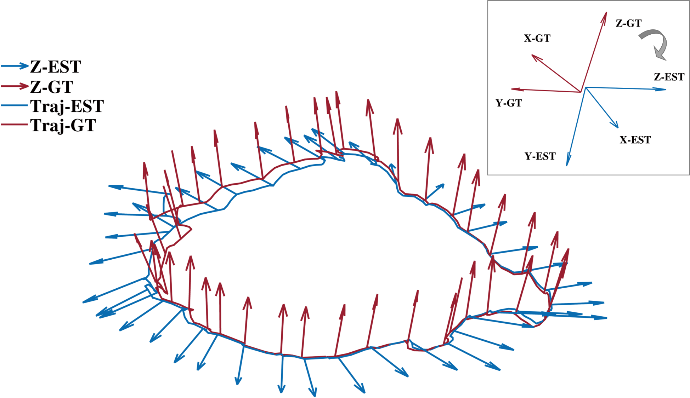

# Evaluation tool (supplement for EVO)

This repository provides **an extra evaluation tool** for [TextSLAM dataset](https://github.com/SJTU-ViSYS/TextSLAM-Dataset/), and serves as a supplement for [EVO](https://github.com/MichaelGrupp/evo).

**Project: TextSLAM: Visual SLAM with Semantic Planar Text Features**

**Authors**: [Boying Li](https://leeby68.github.io/), [Danping Zou](https://drone.sjtu.edu.cn/dpzou/), Yuan Huang, Xinghan Niu, Ling Pei and Wenxian Yu.

🏠 [[Project]](https://leeby68.github.io/TextSLAM/)
&emsp;
📝 [[Paper]](https://ieeexplore.ieee.org/abstract/document/10285400)
&emsp;
🔥 [[Code]](https://github.com/SJTU-ViSYS/TextSLAM/)
&emsp;
➡️ [[Dataset]](https://github.com/SJTU-ViSYS/TextSLAM-Dataset/)
&emsp;

EVO does not automatically rectify the misalignment between the SLAM body frame and the ground-truth body, as shown in the figure. 
The misalignment leads to large RPE errors when directly using EVO for evaluation. 
We hence provide this tool to align the two body frames by an optimization that minimizes their orientation difference before EVO evaluation. 
Note that the misalignment does not affect APE results.

<div align="center">
<br>
<em> Misalignment issue when using EVO. </em>
</div>

Our **accompanying videos** are now available on YouTube (click below images to open) and Bilibili<sup>[1-outdoor](https://www.bilibili.com/video/BV1pe411B7kx/?spm_id_from=333.999.0.0&vd_source=404d99588f2e4c0ce1cca75ed492e620), [2-night](https://www.bilibili.com/video/BV1kC4y1M7tk/?spm_id_from=333.999.0.0&vd_source=404d99588f2e4c0ce1cca75ed492e620), [3-rapid](https://www.bilibili.com/video/BV1Au4y1T7DE/?spm_id_from=333.999.0.0&vd_source=404d99588f2e4c0ce1cca75ed492e620)</sup>.
<div align="center">
<a href="https://youtu.be/ug-FvJKTXJY" target="_blank"></a>
<a href="https://youtu.be/PYrZ5kiIC0Q" target="_blank"></a>
  <a href="https://youtu.be/3Ml6070Hgd8" target="_blank"></a>
</div>

:star: Please consider citing the following papers in your publications if the project helps your works.
```
@article{li2023textslam,
  title={TextSLAM: Visual SLAM with Semantic Planar Text Features},
  author={Li, Boying and Zou, Danping and Huang, Yuan and Niu, Xinghan and Pei, Ling and Yu, Wenxian},
  booktitle={IEEE Transactions on Pattern Analysis and Machine Intelligence (TPAMI)},
  year={2023}
}

@inproceedings{li2020textslam,
  title={TextSLAM: Visual SLAM with Planar Text Features},
  author={Li, Boying and Zou, Danping and Sartori, Daniele and Pei, Ling and Yu, Wenxian},
  booktitle={IEEE International Conference on Robotics and Automation (ICRA)},
  year={2020}
}
```


# Prerequisites

- Refer to [**EVO**](https://github.com/MichaelGrupp/evo) to install EVO.
- Refer to [**Ceres**](http://ceres-solver.org/installation.html#linux) to install Ceres in Linux.

# Process

### Step1. Get EVO intermediate results:
```
python step1_evo_info.py -ref [ground_truth_name].txt -est [estimation_name].txt
```
You will get following files:
```
[estimation_name]_evoalign.txt
[estimation_name]_evoalign_info.txt
[estimation_name]_gt_sync.txt
```
This step saves the intermediate results from the EVO evaluation process.<br>
`[estimation_name]_evoalign.txt` is the estimated results after evo align process, which is equal to `evo_ape/evo_rpe XXX -a -s`.<br>
`[estimation_name]_evoalign_info.txt` is the calculated transformation matrix: rotation matrix, translation vector, scale factor.<br>
`[estimation_name]_gt_sync.txt` is the synchronized ground truth results according to input estimation results.

### Step2. Get corrected GT for evaluation:
**Build step2_align_R**
```
cd step2_align_R
mkdir build
cd build
cmake .. -DCMAKE_BUILD_TYPE=Release
make -j
```
**Run**
```
./align_R [path_to_EVO_intermediate_results] [ground_truth_name].txt [estimation_name].txt
```
You will get following files:
```
[ground_truth_name]_optm.txt
align_res.txt
```
This step saves the results after optimization.<br>
**`[ground_truth_name]_optm.txt` is the pose ground truth after rectifying the misalignment, the corrected GT for evaluation.**<br>
`align_res.txt` is the optimized transformation ```q``` for alignment.<br>


# Acknowledgement

The author thanks [EVO](https://github.com/MichaelGrupp/evo) for providing this convenient evaluation tool.
The author thanks [Ceres](http://ceres-solver.org) for providing this powerful optimization library.
